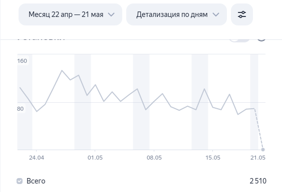
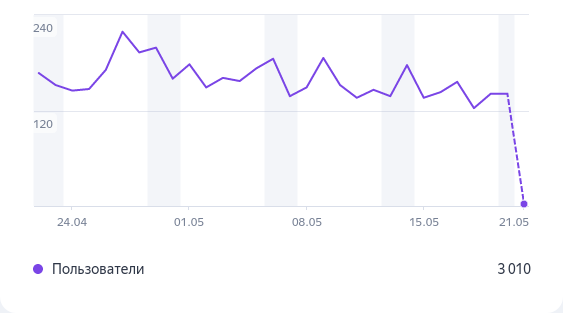
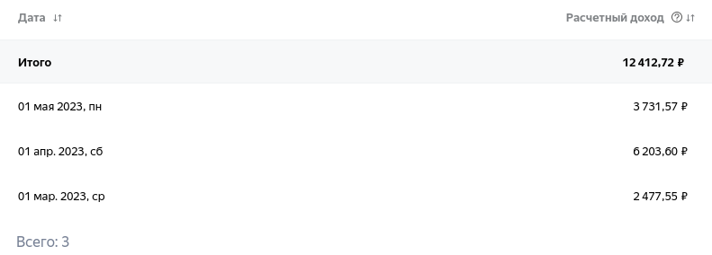

Привет, маслята! 
В этой статье я расскажу о том сколько же мне удалось заработать денег на  мобильном приложении, которое я опубликовал в отечественном магазине приложений Рустор. 
Я покажу вам полностью статистику по скачивания и заработку. Погнали!

## Способы монетизации приложений RuStore

На данный момент в RuStore есть возможность монетизации своего приложения только для юридических лиц. Сюда входят покупки, подписки и т.д
Хотя Рустор и не запрещает пользоваться сторонними сервисами для оплаты, но я решил пока монетизироваться через Рекламную Сеть Яндекса (РСЯ). 

Думаю на данный момент это самый простой способ начать монетизировать свое приложение.
Прочитал документацию на их сайте, подключил SDK и начал зарабатывать.

## Статистика моего приложения

На данный момент мобильное приложение [Скачать YouTube видео](https://apps.rustore.ru/app/ru.zhirnoov.youtubedownloader) скачали около 9 тысяч раз. 
Ниже статистика по скачиваниям и использованию пользователями приложения:

И, конечно же, статистика по использованию:

## Заработок на приложении с РСЯ

Ну что же, вот мы и подошли к самому интересному. Сколько я заработал денег?

Стал ли я богачом и уехал ли я в Дубай отдыхать с моделями как настоящий победитель по жизни? Нет. За всю жизнь моего приложения я сумел заработать 12 400 рублей.

Да, довольно скромно. С другой строны, это абсолютно пассивный доход.
Единственное мне приходится терпеть идиотские отзывы и иногда выпускать обновления.
Ну что же, дальше - больше!