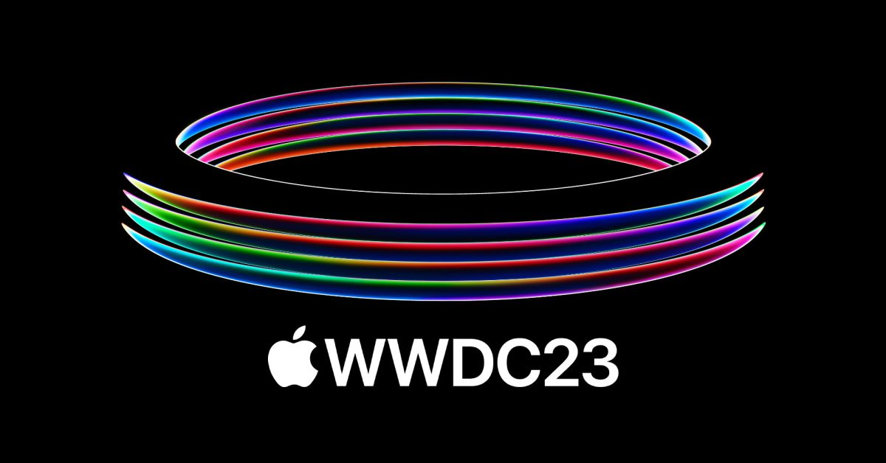

25 мая 2022 года была запущена бета-версия отечественного магазина приложений Rustore при поддержке Министерства цифрового развития, связи и массовых коммуникаций РФ.
С тех пор прошло достаточно времени и рустор стал предустанавливаться на ввозимые мобильные устройства, а посещаемость маркетплейса превысила 10 млн в месяц и продолжает расти. Рустор оставил позади своих конкурентов в лице NashStore, RuMarket и других.

*К сожалению, на данный момент магазин приложений доступен лишь для владельцев Android устройств**

### Почему нет Rustore для айос устройств и когда он появится?

Всё дело в том, что в отличии от системы Android, которая разрешает устанавливать приложения из неизвестных источников благодаря APK, компания Apple сделала свою систему закрытой. Она запрещает устанавливать приложения не из своего официального магазина приложений App Store.

Однако, это было вчера. Дело в том, что в ноябре 2022 года в Евросоюзе вступил в силу новый закон, который обязывает производителей предоставить пользователям доступ к 
сторонним магазинам приложений и разрешить загрузку установщиков из 
интернета. Так что, компании Apple пришлось подчиниться и теперь **в iOS 17 появится возможность устанавливать приложения из любых источников**.

С 5 июня по 9 пройдет WWDC 2023, где Apple представит новую версию своей мобильной операционной системы и расскажет об обновлениях. Там и станет известно как будет работать установка приложений из сторонних источников. Это точно будет революция в мире мобильных технологий!
Будет ли это привязка к Евросоюзу или новая функция распространится и на весь мир? **Только от этого решения и зависит будущее рустора для айос**. Сам магазин приложений рустор ранее заявил о том, что планирует разрешить публикацию приложений для iOS, если Apple предоставит для этого возможности. Надеемся и верим!

> Присоединяйтесь к нашему [Telegram-чату RuStore](https://t.me/rustorechat) **@Rustorechat**, где мы делимся опытом в продвижении и заработке на мобильных приложениях!
>