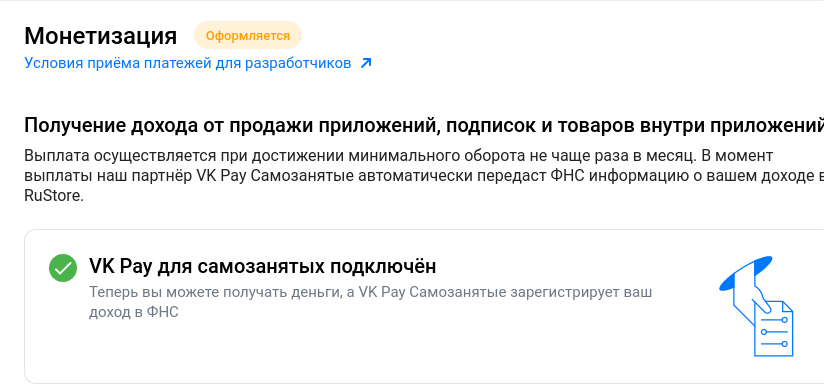

В среду, 24 мая, RuStore в тестовом режиме запустил монетизацию для физических лиц, которые оформились как самозанятые. 
Разработчики обнаружили возможность подключения монетизации в консоли разработчика).
Как сообщает поддержка рустор, возможность монетизации для обычных физлиц(не самозанятых) появится уже в ближайшее время.

## Подключения монетизации

Для того, чтобы подключить монетизацию вам потребуется предоставить доступ к сервису **“VK Pay самозанятые”** в партнерах “Мой налог” и указать свои банковские реквизиты для выплат.

## Выплаты

Выплаты приходят на указанную банковскую карту 1 раз в месяц при достижении минимального порога в 5 тысяч рублей. 

**Пример 1**

Вы подключили монетизацию в середине мая и к концу месяца заработали 4 999 рублей. 
Это ниже минимального порога, и мы не сможем выплатить деньги за май в следующем месяце. Но они будут переведены, когда вы достигнете минимального порога. 
Если это произойдёт в июне — выплата дохода за май и июнь придёт не ранее середины июля и не позднее августа.

**Пример 2**

Вы подключили монетизацию в начале июня и уже к середине месяца заработали 5 500 рублей. Вы достигли минимального порога, но мы не сможем перевести деньги до конца отчетного периода. Выплата дохода за июнь придет не ранее июля.

Кроме того, рустор снизил комиссию для разработчиков в 6 раз! Комиссия, в зависимости от способа оплаты пользователем, составляет от 0,9 до 3,35% и действует с 1 апреля по 31 декабря 2023 года для приложений с суммой платежей менее миллиона рублей за указанный период.

Присоединяйтесь к нашему [Telegram-чату RuStore](https://t.me/rustorechat) **@Rustorechat**, где мы делимся опытом в продвижении и заработке на мобильных приложениях!